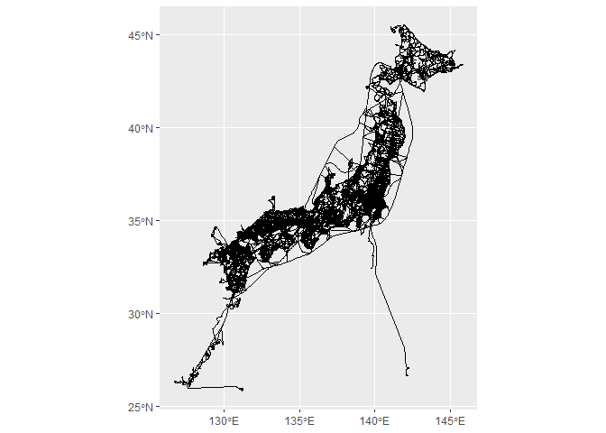

<!-- README.md is generated from README.Rmd. Please edit that file -->

# jptransnetdata

<!-- badges: start -->
<!-- badges: end -->

The goal of jptransnetdata is to …

## Installation

You can install the development version of jptransnetdata like so:

``` r
# install.packages("devtools")
devtools::install_github("UchidaMizuki/jptransnetdata")
```

## Notes

- Source: <https://www.gsi.go.jp/kankyochiri/gm_japan_e.html>
- Terms of use: <https://www.gsi.go.jp/ENGLISH/page_e30286.html>

## Example

This is a basic example which shows you how to solve a common problem:

``` r
library(jptransnetdata)

library(tidyverse)
library(sfnetworks)
```

``` r
jptransnetdata::transport_network_global_map_v2_2 |> 
  activate(edges) |> 
  as_tibble() |> 
  ggplot() +
  geom_sf()
```


